# HAB-Tracker

**Mia W**  
**Presentation of Learning**  
**Passion Project:** High Altitude Balloon (HAB)  
**Flight date:** June 4, 2025

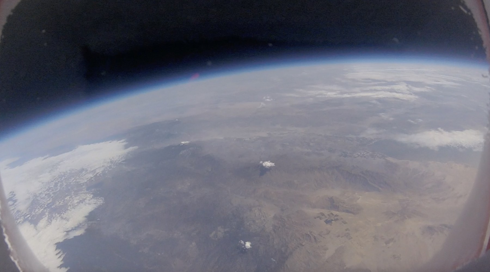

## Goals

My goals at the beginning of the year were to:

- Make it through the year
- Get study habits

Me as a learner:

- I love to learn new things and try to be energetic about it

## Passion Project

**High Altitude Balloon (HAB)**

## Explanation

High Altitude Balloons are balloons meant to reach a high altitude in the Earth's atmosphere, typically for research or other reasons.

When it gets higher, the air gets thinner and the balloon expands. Eventually, it bursts.

## Parts

Parts list:

- RockBLOCK 9603 Iridium Satellite Modem Bundle
- Adafruit Metro M4 feat. Microchip ATSAMD51
- PowerBoost 1000 Charger
- Lithium Ion Battery Pack, 3.7V 6600mAh
- Monochrome 1.3" 128x64 OLED graphic display
- Adafruit BMP280 Barometric Pressure & Altitude Sensor
- Adafruit Mini GPS PA1010D
- Adafruit Qwiic / Stemma QT 5 Port Hub
- Kaymont 160V Meteorological Parachute, 180g
- HAB-1000 Natural Latex Balloon
- GoPro Hero
- One full tank of helium from a party supply store

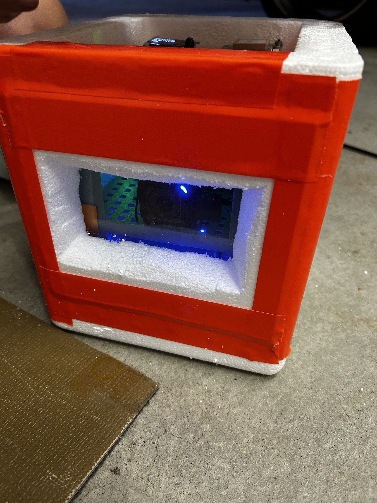

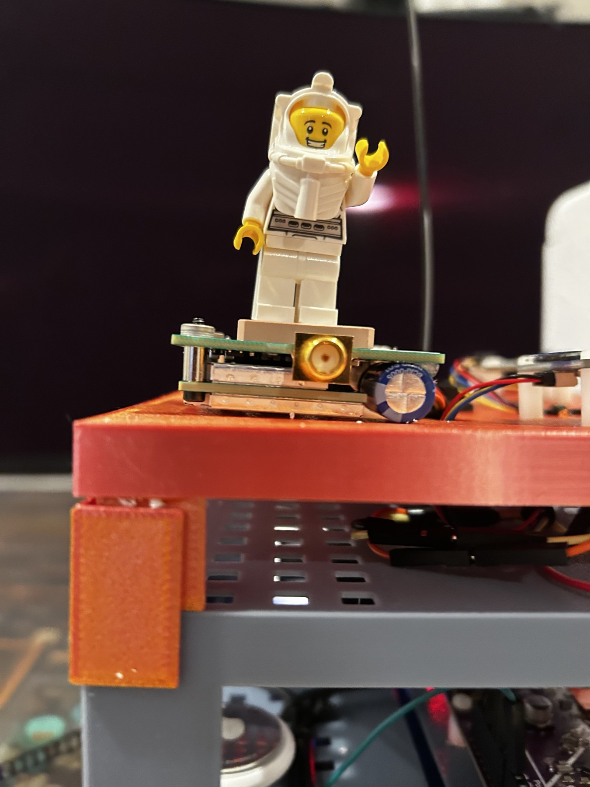

## Process

Process of coding, building, and assembling a high altitude balloon.

I learned how to write code in Python, helped choose sensors, and designed the 3D print structure for the payload case in CAD.

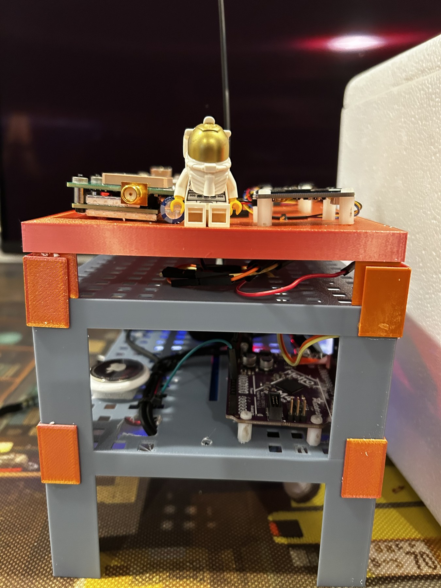

## Code & Design

Code:

- [`src/circuitpy_code`](src/circuitpy_code)
- [`src/receiver_code`](src/receiver_code)

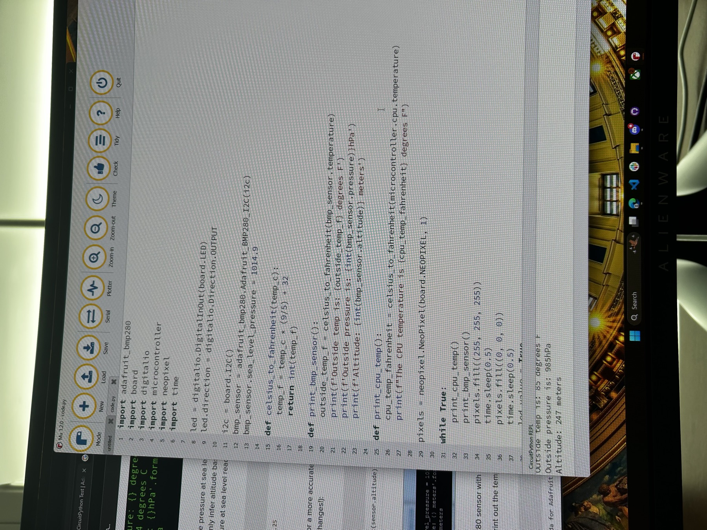

Example flight messages:

| Message | Time | Raw message | Location | Altitude | Satellites | Battery | Temperature |
| --- | --- | --- | --- | --- | --- | --- | --- |
| #1 | 2025-06-04 15:55:42 UTC | `33.0127|-116.4671|16333|14|3.3|48` | `33.0127, -116.4671` | 16,333 m | 14 | 3.3 V | 48 F |
| #2 | 2025-06-04 15:53:42 UTC | `32.9921|-116.5373|14839|15|3.3|53` | `32.9921, -116.5373` | 14,839 m | 15 | 3.3 V | 53 F |

Device ID used in the logs: `301434061666900`

We stopped getting location updates at 2,800 m. It was still sending messages from the balloon, but the sensor data was exactly the same. It started working again later in the tracker.

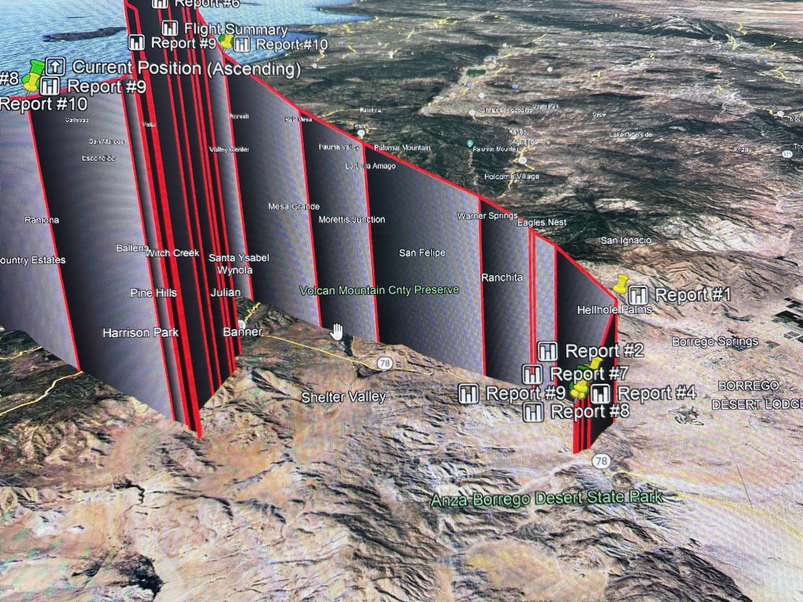

## Assembling

After recovery, the payload had been recording for nearly 14 hours. We drove to the closest point we could reach near Banner Grade / Anza-Borrego in San Diego, then searched on foot until we found it. The desert temperature was above 100 F, and the heat inside the payload partially melted the 3D printed scaffolding.

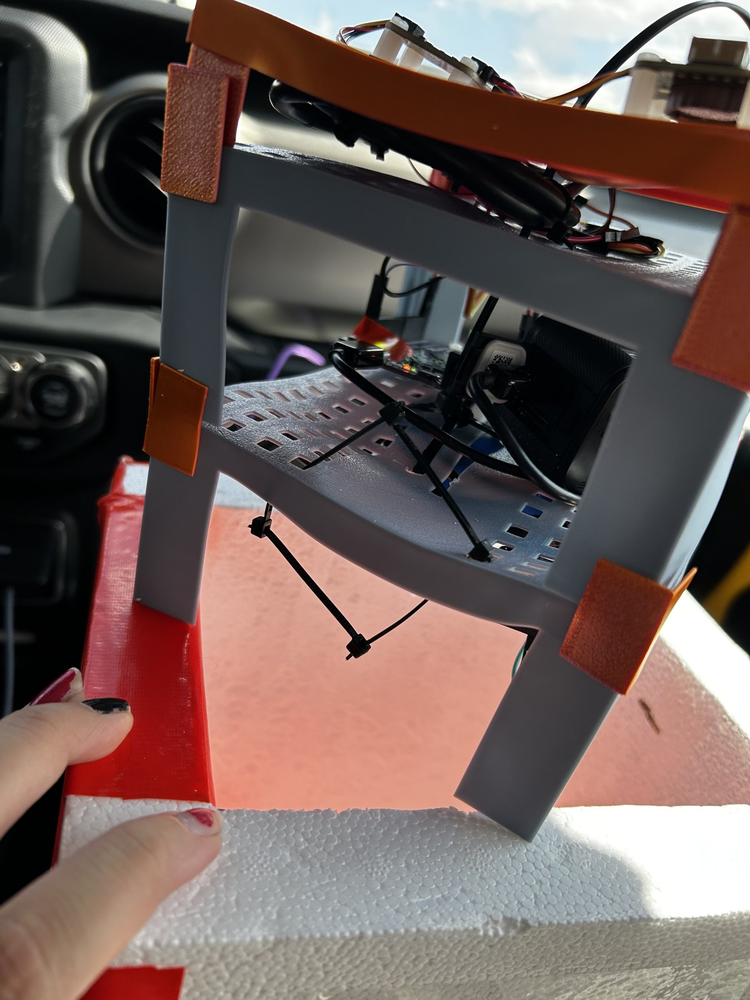

## LAUNCH

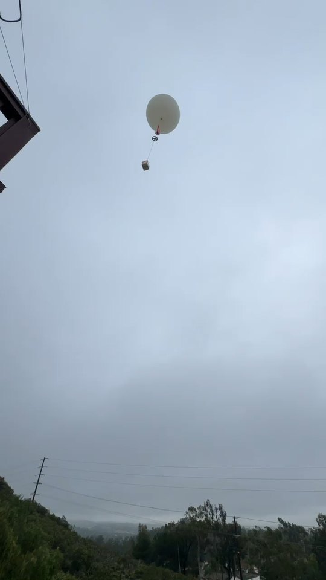

[Download launch MP4](assets/videos/launch.mp4?raw=1)

## Flight Path

Recovery lookup:

`33.128000, -116.320800`

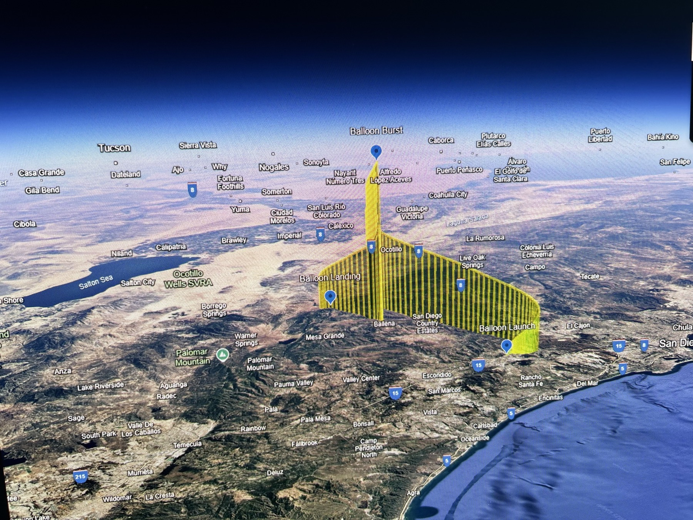

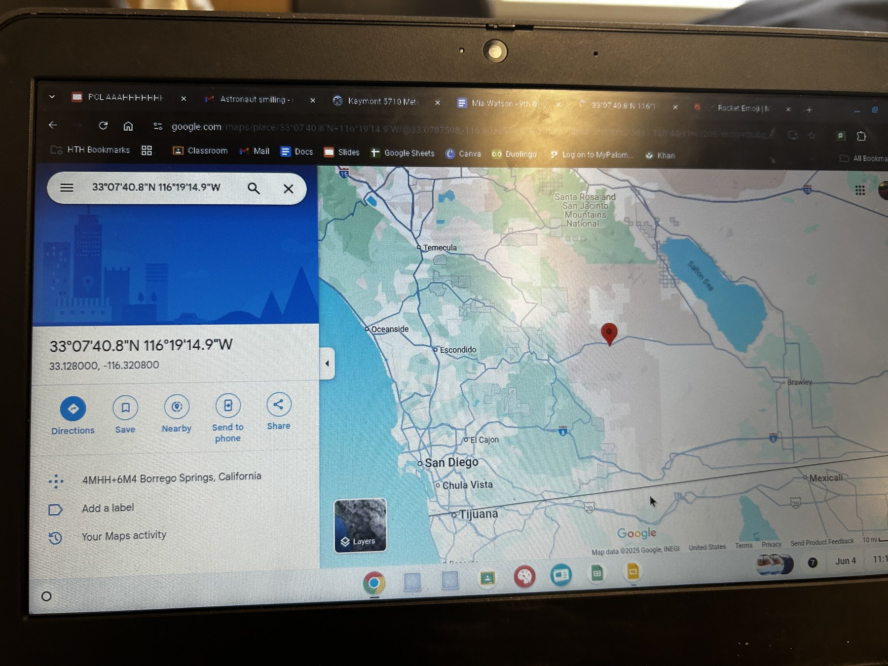

## Finding it!

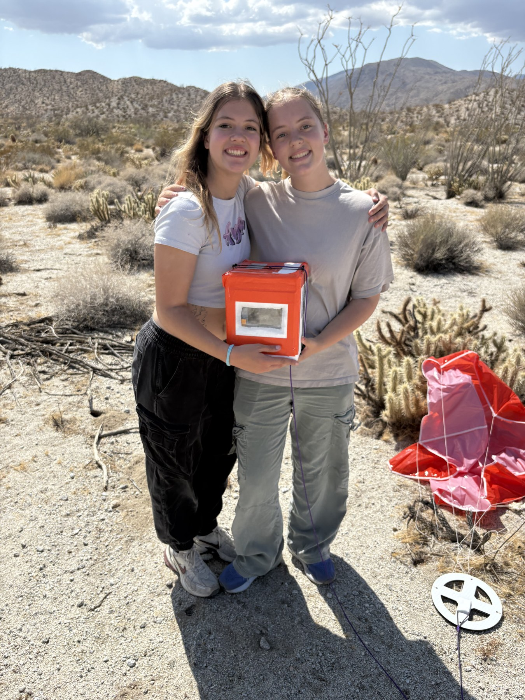

## FINAL RESULTS

## Final Result!!

- Passing cloud cover after launch
- Curvature of Earth!!
- Max altitude: 24,788 m, about 82k ft
- Target altitude: 100k ft
- Balloon popping around 30 ft in diameter
- Parachute deployment!

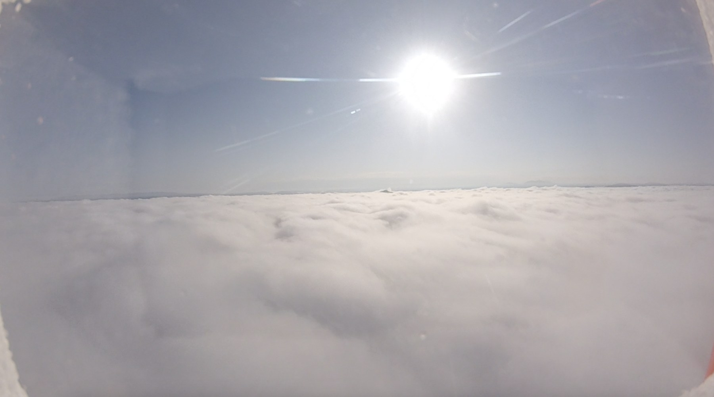

## Videos

### Passing cloud cover after launch

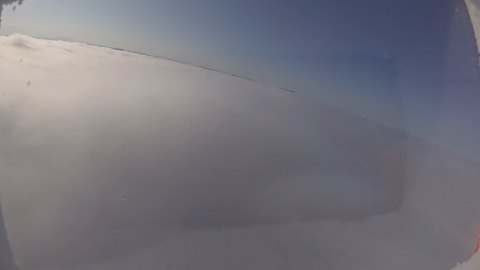

[Download MP4](assets/videos/clouds.mp4?raw=1)

### Curvature of Earth!!

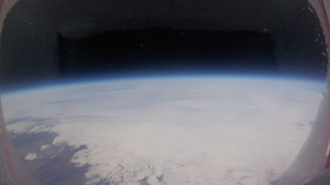

[Download MP4](assets/videos/top-of-flight.mp4?raw=1)

### Floating at 82k ft

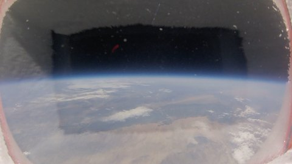

[Download MP4](assets/videos/floating-82k.mp4?raw=1)

### Balloon popping

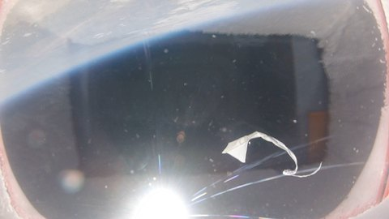

[Download MP4](assets/videos/balloon-pop.mp4?raw=1)
